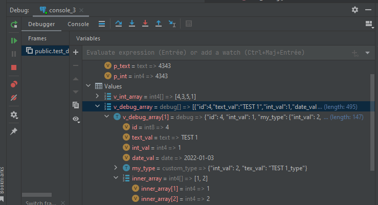
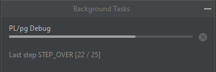

# Intellij PL/pg SQL debugger

<!-- Plugin description -->
Debug PL/pg SQL in Intellij with Database Tool module to speed up and improve productivity with PostgreSQL 
Allow to debug a query from the console like you run it normally: inspect variables and set breakpoints 
The pldbgapi extension must be enabled on the target database. 
This plugin is in early stage of development.  

Submit features => [Production ready task list](https://github.com/ng-galien/idea-plpgdebugger/issues/17)  
Report a bug or a problem => [Create an issue](https://github.com/ng-galien/idea-plpgdebugger/issues/new/choose)
<!-- Plugin description end -->

## Features

### Direct debug from a console from a SELECT statement

### Variable inspection

(Composite types are not returned by the extension)

  * Basic variables
  * Arrays(including array of composite)

### Inline values

Arguments and variables are displayed in code, it can be disabled in the plugin configuration.  

### Debug process

The debugger activity is visible as a background process in the IDE

## Limitation

The standard pldbgapi does not send back composite variable, but you can put it in arrays to inspect them.  
A modified extension is available in this [repo](https://github.com/ng-galien/pldebugger), hope this can be integrated in the official extension soon.  
At the moment indirect debugging is not supported but will be available soon.

## Installation

### Server
You must first install the debugger extension and activate the shared library onto the server.  
Follow these [instructions for PgAdmin](https://www.pgadmin.org/docs/pgadmin4/development/debugger.html)

### IDE

- Using IDE built-in plugin system:
  
  <kbd>Settings/Preferences</kbd> > <kbd>Plugins</kbd> > <kbd>Marketplace</kbd> > <kbd>Search for "idea-plpgdebugger"</kbd> >
  <kbd>Install Plugin</kbd>
  
- Manually:

  Download the [latest release](https://github.com/ng-galien/idea-plpgdebugger/releases/latest) and install it manually using
  <kbd>Settings/Preferences</kbd> > <kbd>Plugins</kbd> > <kbd>⚙️</kbd> > <kbd>Install plugin from disk...</kbd>

---
Plugin based on the [IntelliJ Platform Plugin Template][template].

[template]: https://github.com/JetBrains/intellij-platform-plugin-template
